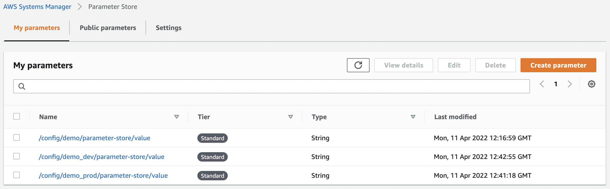

# Spring Cloud with AWS Parameter Store

This is a demo project that shows how the Spring Cloud integrates with AWS Parameter Store in order to securely get
parameter values.

## Setup

- After creating an AWS account I added the `AWS_ACCESS_KEY_ID` and `AWS_SECRET_ACCESS_KEY` as environment variables in
  order to connect to it.
- I created some random parameters in the Parameter Store using the
  format: `/config/<name-of-the-spring-application>_<profile>/<parameter-name>`

- Created a bootstrap.yaml in order to config the application name and the `aws-paramstore`.
- One common setting is `aws.paramstore.fail-fast` set to `true`, which throws exceptions during config lookup if true,
  otherwise, log warnings. By setting this we can detect if the connection to the AWS is compromised during the
  application starting process.

### Why having a bootstrap.yml?

We use bootstrap.yml for configuring the bootstrap context. This way we keep the external configuration for bootstrap
and main context separated. The bootstrap context is responsible for loading configuration properties from the external
sources and for decrypting properties in the local external configuration files. When the Spring Cloud application
starts, it creates a bootstrap context. The first thing to remember is that the bootstrap context is the parent context
for the main application. 
In order for the bootstrap file to be loaded we need this starter `spring-cloud-starter-bootstrap`, 
otherwise it won't load the bootstrap context.

### Refresh Parameter value

By using the `refresh` endpoint on the actuator we can get the values updated from the Parameter Store without
reinitialising the application. The refresh config is defined in the `application.yaml` with:

`management:
  endpoints:
    web:
      exposure:
        include: refresh`

- Also, the parameters can be declared in the application.yml for each profile in order to have a default value.